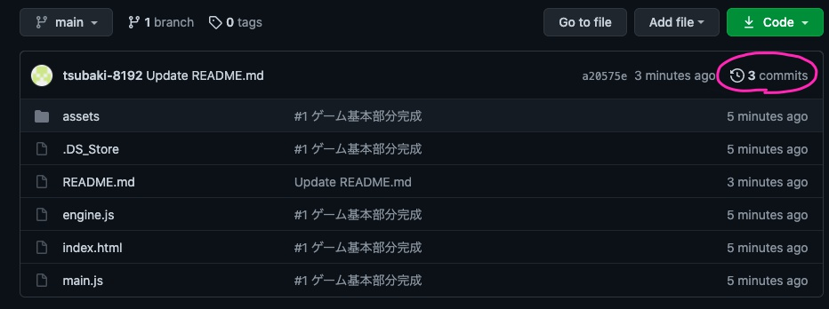
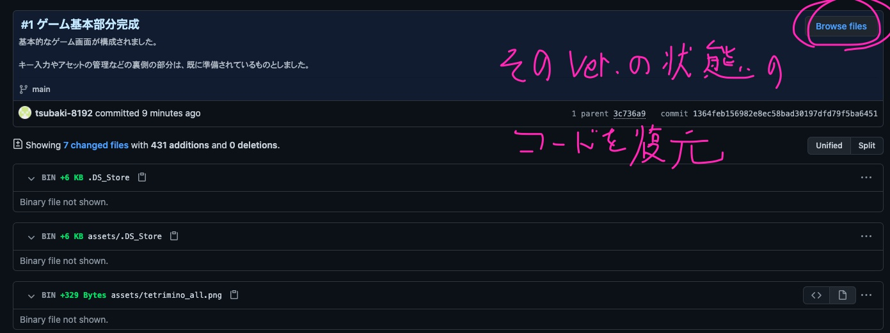
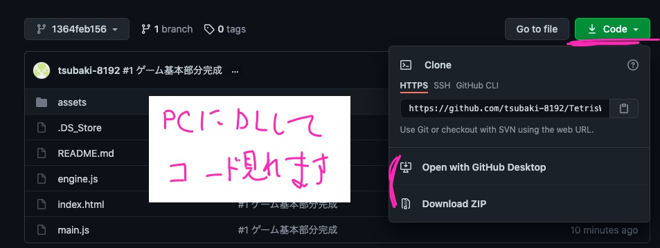
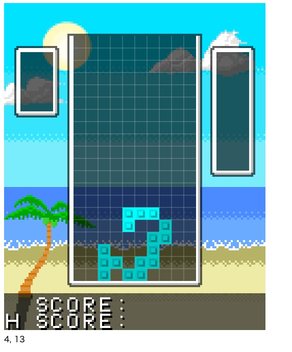
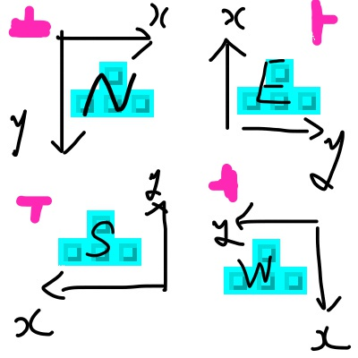
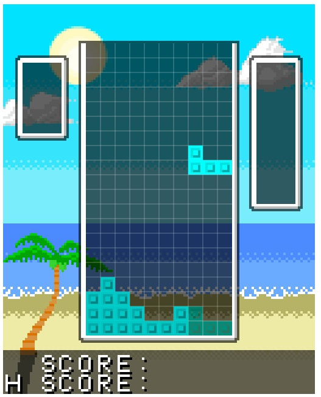
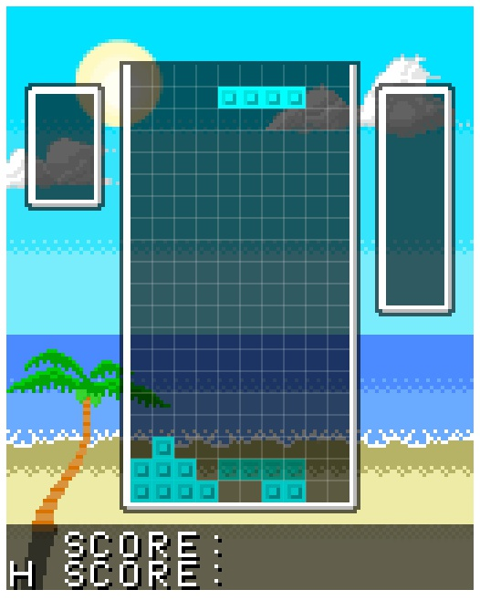
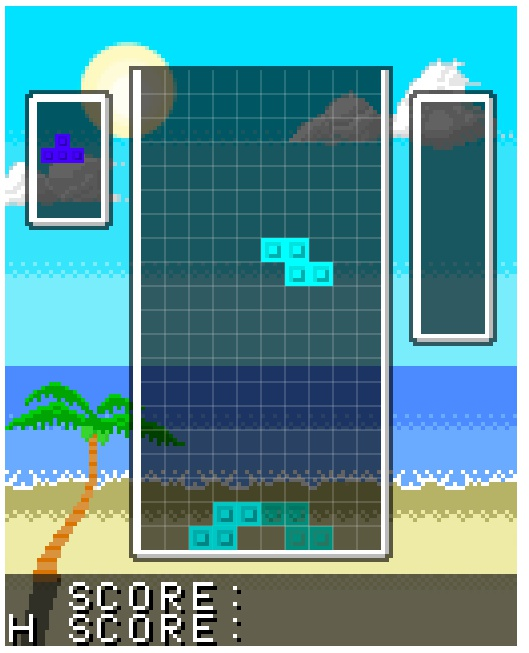
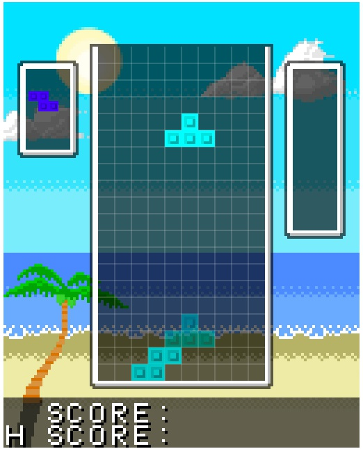

# TetrisWeb
Web上で動作するテトリスを作成。  
画像等はPICマイコン用を流用。  
Javascriptやゲーム作成の基礎を習得してもらいたいです。

**現行Ver.を手っ取り早く確認**  
https://tsubaki-8192.github.io/TetrisWeb/index.html

履歴を追いながら勉強することで、  
自分でTetrisを作るようにしながら学べるリポジトリを作りたいです。  

ぜひ活用してください。

<small>このReadmeもできるだけリンクを豊富にして、  
閲覧しやすいようには気を付けます。</small>

## 目次
-	[チャプター](#チャプター)  
	[Chapter0 使い方](#Chapter0)  
	[Chapter1 ゲームの基本画面完成まで](#Chapter1)  
	[Chapter2 テトリミノの操作(落下・固定・回転)](#Chapter2)  
	[Chapter3 ライン消去 ***New!***](#Chapter3)  
	[Chapter4 Holdの実装 ***New!***](#Chapter4)  
	[(未実装) Chapter5 画面の整備(Score・Next)](#Chapter5)  
	[(未実装) Chapter6 シーン遷移(Menu・GameOver)](#Chapter6)  
	[(未実装) Chapter7 音楽(BGM・効果音)の実装](#Chapter7)  
	[(未実装) Chapter8 ワールドルールに準拠した回転と操作性の向上](#Chapter8)  
	[(未実装) Chapter? キーコンフィグの設定](#Chapter?)  
	[(未実装) Chapter? 簡易リプレイ機能の実装](#Chapter?)  
	[(未実装) Chapter? スマホへの対応](#Chapter?)  

## [チャプター](#目次)
### [Chapter0](#目次)  
**使い方(4/24 Upload)**  

各種チャプターのコードをダウンロードする方法  
チャプターがわかりやすいよう、僕が更新するときに頑張ります。  

------

以降、解説



更新 = commit(と思って良い)ので、commitの履歴を確認します。  


閲覧したいチャプターのcommitID(?)をクリックし、  
commit情報のページへ



ここで、当該commitにて変更された情報だけを確認できます。  
そうではなく全てのファイルを見たい場合は、Browse Filesで移動



Web上で見ることができるようになります。  

実際に動かしたい場合もあると思います。  
Downlowd ZIPで自分のPCにダウンロードすると良いでしょう。  
Open with...でも大丈夫な気がしますが、使ってないのでわかりません。

> Web上で見ることができるようになります。  

普段はmainブランチ(や、[name]_mainブランチ)を編集していますが、  
別のブランチに移動しているようなものですね。  
各commitにはIDが割り振られており、このような状態復元が可能です。


### [Chapter1](#目次)
**ゲームの基本画面完成まで(4/24 Upload)**  

[完成版commit](https://github.com/tsubaki-8192/TetrisWeb/commit/1364feb156982e8ec58bad30197dfd79f5ba6451)

#### 完成画面


---

#### 説明等

他のゲームでも共通の部分が多いので、  
ここは別に、いま深く勉強しなくて良いです。  
特に難しいところもないですが、  
一応テトリスのボード管理は高さ方向に一マス多めに取ってます。  
見えないところにもミノを配置できるようになります。

### [Chapter2](#目次)
**テトリミノの操作(4/25 Upload)**  

[完成版commit](https://github.com/tsubaki-8192/TetrisWeb/commit/078fc788018bdb4498c1f438374f5c6e3bf40560)

#### 完成画面



---

#### 説明等

##### Minoクラス
テトリミノ自体の情報は極限まで減らした方がラクです。  
今回は、位置(x, y)・形状(IDのみ)・向き(4方向)だけ持ちます。  
特に、ミノの状態は4×4の配列を定義して、  
回転するたびに中身を書き換えても良いのですが、もっとラクな方法をとってます。  
patternプロパティを呼び出したときに、その配列にあたるものを生成してます。  

##### 当たり判定
テトリミノの当たり判定が少し難しいところかと思います。

1.	移動先が壁などであるか、予めチェックしてから動く
1.	一旦移動してみて、そこが壁かチェックする。

パッと思いつくのは1.だと思いますが、実は2.の方が実装が楽です。

##### コピー
クラスをコピーして

```
A = new Mino(0);
B = A;
A.dir = 4;
```

などとしてしまうと、B.dirの方も書き変わってしまいます。  
(dirやtypeなどの個別の値の代入ではなく、Aの参照先をBもコピーさせてもらうような感じ)  
そこで、

```
copy(mino) {
	this.type = mino.type;
	this.dir = mino.dir;
	this.x = mino.x;
	this.y = mino.y;
}
```

このように、いちいち中身を書き換えてコピーを実現します。


##### 回転


難しいですが、このような図を使って考えています。  
参照先のgetMinoはNorth向きの形しか得られないので、そこを固定して考えます。  
したがって、回転によって変わるのはミノではなく、座標軸です。  
N->Eは時計回りなので、座標軸は逆に反時計回りします。  

ミノの形状配列が必ず正方形で、縦横の数が同じなので、やりやすいです。

```
// #2完成版の107-121行目の擬似コード
// コードの配列(y,x)とは異なり、通常座標と同じく(x,y)の順とする。
loop y
	loop x 
			East:
				回転後(x,y) = 元配置(y, NumY - x);
			South:
				回転後(x,y) = 元配置(NumX - x, NumY - y);
			West
				回転後(x,y) = 元配置(NumX - y, x);
		
	end
end
```

軸の方向や、変更後はx成分なのかy成分なのかを考えると分かるのではないでしょうか。

##### ボタン/キー配置
馴染みやすい配置は実際に触ってみないと分からないので、試行錯誤です。  

##### 画像素材


通常のゲームでは、できるだけ複数画像を一枚の絵にまとめます。  
テトリス程度では十数個の絵で済みますが、RPGなどでは数百や数千となるでしょう。  
テトリミノによって配色を変えるのも、後々実装します。

### [Chapter3](#目次)
**ライン消去(4/26 Upload)**  

[完成版commit](https://github.com/tsubaki-8192/TetrisWeb/commit/53a78da316db41ea51c3f32debb20bce8fc0c7e1)

#### 完成画面




---

#### 説明等
ミノを固定するためのメソッドを用意して、  
その中でライン消去の判定も行っています。  
ライン消去が必要かどうかの判定は、上からでも下からでも構いませんが、  
ラインを消したときに下へ詰める場合は、下からループしていった方が簡単です。  
(上からだと、一旦下の行を保存してからその行を下に詰めないといけない)  
最後に一番上の行には0を詰めることを忘れないように。

落下位置の予測やハードドロップ機能もつけていますが、  
一つ一つずらして判定していく、意外と地道なものです。

### [Chapter4](#目次)
**Holdの実装(4/26 Upload)**  

[完成版commit](https://github.com/tsubaki-8192/TetrisWeb/commit/53a78da316db41ea51c3f32debb20bce8fc0c7e1)

#### 完成画面




---

#### 説明等
Holdを連続でできるようにしてしまうと簡単すぎるので、   
それはさせないように注意します。  
あとはそんなに難しくないでしょう。  