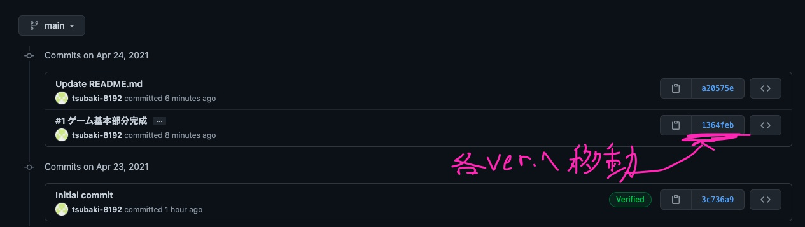
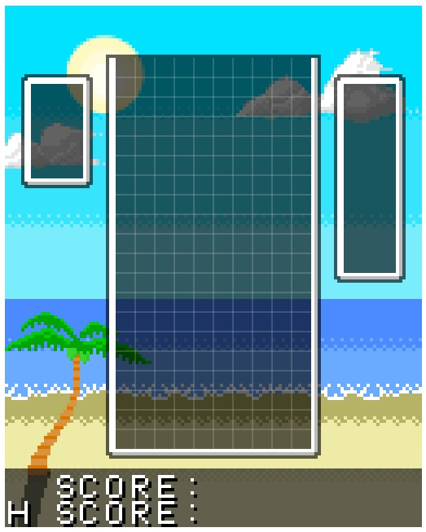

# TetrisWeb
Web上で動作するテトリスを作成。  
画像等はPICマイコン用を流用。  
Javascriptやゲーム作成の基礎を習得してもらいたいです。

履歴を追いながら勉強することで、  
自分でTetrisを作るようにしながら学べるリポジトリを作りたいです。  

ぜひ活用してください。

<small>このReadmeもできるだけリンクを豊富にして、  
閲覧しやすいようには気を付けます。</small>

## 目次
-	[チャプター](#チャプター)  
	[Chapter0 使い方](#Chapter0)  
	[Chapter1 ゲームの基本画面完成まで](#Chapter1)  
	[(未実装) Chapter2 テトリミノの操作(落下・固定・回転)](#Chapter2)  
	[(未実装) Chapter3 ライン消去](#Chapter3)  
	[(未実装) Chapter4 Holdの実装](#Chapter4)  
	[(未実装) Chapter5 画面の整備(Score・Next)](#Chapter5)  
	[(未実装) Chapter6 シーン遷移(Menu・GameOver)](#Chapter6)  
	[(未実装) Chapter7 音楽(BGM・効果音)の実装](#Chapter7)  
	[(未実装) Chapter8 ワールドルールに準拠した回転の実装](#Chapter8)  

## [チャプター](#目次)
### [Chapter0](#目次)  
**使い方(4/24 Upload)**  

各種チャプターのコードをダウンロードする方法  
チャプターがわかりやすいよう、僕が更新するときに頑張ります。  

------

以降、解説

更新 = commit(と思って良い)ので、commitの履歴を確認します。  

閲覧したいチャプターのcommitID(?)をクリックし、  
commit情報のページへ

ここで、当該commitにて変更された情報だけを確認できます。  
そうではなく全てのファイルを見たい場合は、Browse Filesで移動

Web上で見ることができるようになります。  

実際に動かしたい場合もあると思います。  
Downlowd ZIPで自分のPCにダウンロードすると良いでしょう。  
Open with...でも大丈夫な気がしますが、使ってないのでわかりません。

> Web上で見ることができるようになります。  

普段はmainブランチ(や、[name]_mainブランチ)を編集していますが、  
別のブランチに移動しているようなものですね。  
各commitにはIDが割り振られており、このような状態復元が可能です。

### [Chapter1](#目次)
**ゲームの基本画面完成まで(4/24 Upload)**  
#### 完成画面

---

#### 説明等

他のゲームでも共通の部分が多いので、  
ここは別に、いま深く勉強しなくて良いです。  
特に難しいところもないですが、  
一応テトリスのボード管理は高さ方向に一マス多めに取ってます。  
見えないところにもミノを配置できるようになります。